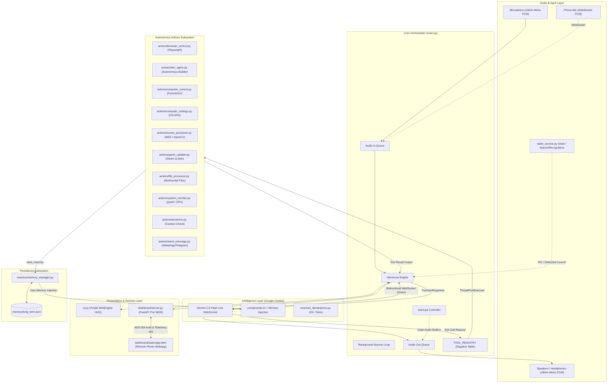
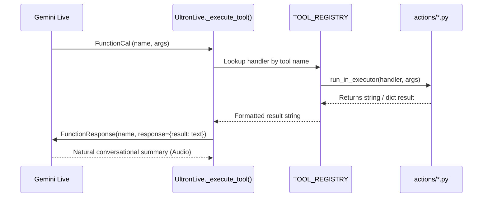

# ULTRON System Architecture & Internal Mechanics

This document outlines the end-to-end technical architecture, concurrency models, protocols, and data flows of the **ULTRON AI Desktop Assistant**.

---

## 1. High-Level Architecture Diagram



---

## 2. Concurrency & Threading Model

ULTRON employs a multi-threaded, asynchronous concurrency model to guarantee that user interface animations, voice playback, and heavy background automations never block one another:

| Component | Execution Context | Responsibility |
| :--- | :--- | :--- |
| **PyQt6 GUI** | **Main Thread** (`QApplication.exec()`) | Renders HUD visuals, WebEngine canvas, audio visualizers, and handles OS window messages. |
| **Asyncio Core Loop** | **Dedicated Daemon Thread** | Maintains the persistent WebSocket connection to Google Gemini Live, manages audio queues, and schedules tasks. |
| **Audio Input Thread** | **sounddevice InputStream Callback** | Continuous non-blocking 16kHz audio capture from the local microphone. |
| **Audio Output Thread** | **sounddevice OutputStream Callback** | Continuous non-blocking 24kHz audio playback to the local speakers. |
| **Tool Execution** | **concurrent.futures.ThreadPoolExecutor** | Heavy operations (Playwright, OpenCV image compression, Dev Agent iterations, file conversions) run off-loop via `loop.run_in_executor(None, ...)`. |
| **Wake Word Service** | **Independent OS Process** (`wake_service.py`) | Lightweight daemon constantly listening for "Wake up Ultron" and probing socket port `39152`. |
| **Dashboard Server** | **Background Thread** (Uvicorn ASGI) | FastAPI server serving HTTP endpoints and WebSockets on port `8000`. |

---

## 3. Gemini Live Bidirectional Audio Protocol

The real-time conversational voice experience is powered by Google's native multimodal streaming protocol:

```mermaid
sequenceDiagram
    autonumber
    actor User
    participant Mic as SoundDevice Mic (16kHz)
    participant Core as main.py (UltronLive)
    participant Cloud as Gemini 2.5 Flash Live API
    participant Spk as SoundDevice Speaker (24kHz)

    User->>Mic: Speaks "What is my CPU usage?"
    Mic->>Core: 16kHz PCM Chunks (512 samples)
    Core->>Cloud: RealtimeInput (audio/pcm;rate=16000)
    Note over Cloud: Speech Recognition & Intent Inference
    Cloud-->>Core: ToolCall: system_status()
    Core->>Core: Dispatch to background executor
    Core->>Cloud: ToolResponse: {cpu: 18%, ram: 42%, temp: 51C}
    Cloud-->>Core: Audio Stream (24kHz PCM chunks)
    Core->>Spk: Raw audio playback
    Spk-->>User: "Your CPU usage is currently 18 percent, sir."
```

### Interrupt / Barge-In Mechanism
When the user begins speaking while ULTRON is speaking:
1. `on_interrupt` callback triggers `UltronLive.interrupt()`.
2. Outbound audio playback queue is immediately purged.
3. `_is_speaking` state switches to `False`.
4. UI transitions immediately from `SPEAKING` to `LISTENING`.
5. Gemini Live detects new incoming audio frames and halts generation of the previous turn.

---

## 4. Tool Dispatch & Execution Architecture

Tool declarations reside in [core/tool_declarations.py](file:///f:/ultronmain-main/core/tool_declarations.py). The model decides when to call a tool based on user context and strict routing rules in [core/prompt.txt](file:///f:/ultronmain-main/core/prompt.txt).



---

## 5. Remote Mobile Dashboard & WebSockets

ULTRON includes a built-in mobile control server hosted locally on port `8000`:
- **Security**: Authenticated via AES-256-CBC session keys generated dynamically and encoded into a QR code shown in the UI HUD.
- **WebSocket Telemetry**: Telemetry packets containing CPU, RAM, GPU, Battery, and ULTRON state (`LISTENING`, `THINKING`, `SPEAKING`) are broadcast every 1.5 seconds.
- **Remote Microphone**: The mobile browser streams raw audio over the WebSocket, which is routed directly into ULTRON's `audio_in_queue`.
- **Remote Control & App Launcher**: Smartphone users can launch apps, trigger media controls, upload files, or view camera/screen feeds remotely over the local WiFi network.

---

## 6. Long-Term Memory & Proactive Subsystem

### Memory Structure (`memory/long_term.json`)
The memory subsystem organizes persistent knowledge about the user into 6 distinct categories:
- `identity`: Name, age, location, occupation, language.
- `preferences`: Favorite foods, themes, music, sports, habits.
- `projects`: Current active software or hardware projects and goals.
- `relationships`: Colleagues, friends, family context.
- `wishes`: Future plans, wishlists, travel desires.
- `notes`: Miscellaneous schedules and contextual notes.

Every memory item includes an `updated` timestamp. When memory approaches `MEMORY_MAX_CHARS` (default ~2200 chars), the oldest, least relevant entries are automatically trimmed to preserve LLM token context windows.

### Proactive Engine (`actions/proactive.py`)
- Tracks duration of user silence via `time.monotonic()`.
- If user has been silent for $> 15$ minutes and cooldown $> 10$ minutes has elapsed, it builds a `[PROACTIVE_CHECK]` prompt with current time and memory context.
- Gemini receives this context and determines whether to make a thoughtful, natural check-in.
